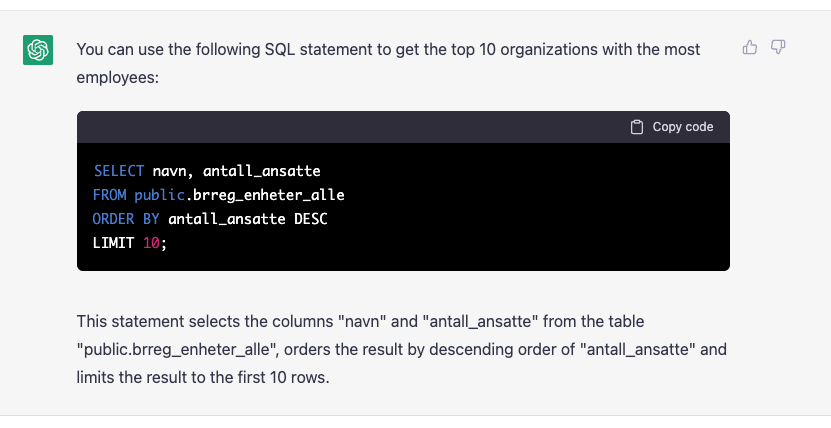
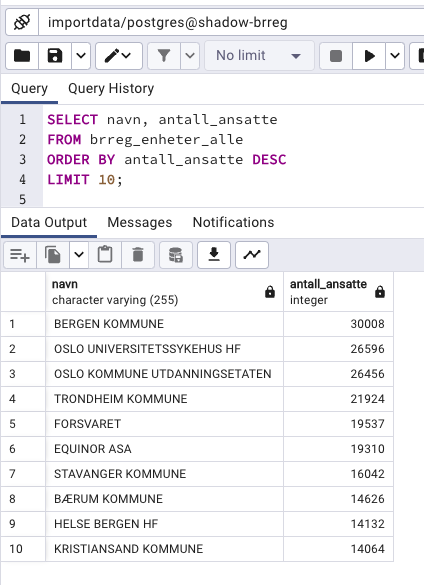

# First ChatGPT session

Purpose is to get the first response from ChatGPT and see some data.


## Introduce yourself :)

Good morning. I don't know sql and I need some help on writing sql statements to access my data. The definition of the table I want to access is:

```sql
CREATE TABLE brreg_enheter_alle (
    organisasjonsnummer character varying(10) NOT NULL,
    navn character varying(255),
    organisasjonsform_kode character varying(10),
    organisasjonsform_beskrivelse character varying(255),
    naringskode_1 character varying(10),
    naringskode_1_beskrivelse character varying(255),
    naringskode_2 character varying(10),
    naringskode_2_beskrivelse character varying(255),
    naringskode_3 character varying(10),
    naringskode_3_beskrivelse character varying(255),
    hjelpeenhetskode character varying(10),
    hjelpeenhetskode_beskrivelse character varying(255),
    antall_ansatte integer,
    hjemmeside character varying(255),
    postadresse_adresse character varying(255),
    postadresse_poststed character varying(255),
    postadresse_postnummer character varying(10),
    postadresse_kommune character varying(255),
    postadresse_kommunenummer character varying(10),
    postadresse_land character varying(40),
    postadresse_landkode character varying(10),
    forretningsadresse_adresse character varying(255),
    forretningsadresse_poststed character varying(255),
    forretningsadresse_postnummer character varying(10),
    forretningsadresse_kommune character varying(40),
    forretningsadresse_kommunenummer character varying(10),
    forretningsadresse_land character varying(40),
    forretningsadresse_landkode character varying(10),
    institusjonell_sektorkode character varying(10),
    institusjonell_sektorkode_beskrivelse character varying(255),
    siste_innsendte_arsregnskap character varying(20),
    registreringsdato_i_enhetsregisteret character varying(20),
    stiftelsesdato character varying(20),
    frivilligregistrertimvaregisteret character varying(100),
    registrert_i_mva_registeret character varying(10),
    registrert_i_frivillighetsregisteret character varying(10),
    registrert_i_foretaksregisteret character varying(10),
    registrert_i_stiftelsesregisteret character varying(10),
    konkurs character varying(10),
    under_avvikling character varying(10),
    under_tvangsavvikling_eller_tvangsopplasning character varying(10),
    overordnet_enhet_i_offentlig_sektor character varying(50),
    malform character varying(10)
);
```

The table brreg_enheter_alle is a table of organisations in Norway. The field organisasjonsnummer is the unique id, the field navn is the name of the organisation and the field antall_ansatte is the number of employees in the organisation.

Can give me the sql statement that lists the names and number of employees in organisations that has the most employees. Give me the top 10.



Just click on the `Copy code` button to copy the code to your clipboard. Then paste it into pgAdmin in your web browser and click on the `Play` button. You should now see the result of the query like this:



## But what if you dont know english?

You can even write the question in your native language. This is how I, in Norwegian, asked ChatGPT to list all organizations that have gone bankrupt.

>Lag sql som lister navn og antall ansatte i organisasjoner som ikke har feltet konkurs satt til NEI. Gi meg topp 10 og sorter slik at den med flest ansatte er øverst.

```sql
SELECT navn, antall_ansatte FROM brreg_enheter_alle WHERE konkurs != 'NEI' ORDER BY antall_ansatte DESC LIMIT 10;
```

## You can define concepts 

You can define concepts and then use them in your queries. This is how I defined the concept `bankrupt`. I also told ChatGPT that the field stiftelsesdato is a date. It seems that ChatGPT already know the concept of oldest and that is can be applied to dates.  

>When the field konkurs is set to something different than NEI it means that the company is bankrupt. The field stiftelsesdato is the date that the company was created. Write a sql that lists name, stiftelsesdato and antall ansatte of the 10 oldest companies that are bankrupt.

```sql
SELECT navn, stiftelsesdato, antall_ansatte
FROM brreg_enheter_alle
WHERE konkurs != 'NEI'
ORDER BY stiftelsesdato ASC
LIMIT 10;
```

