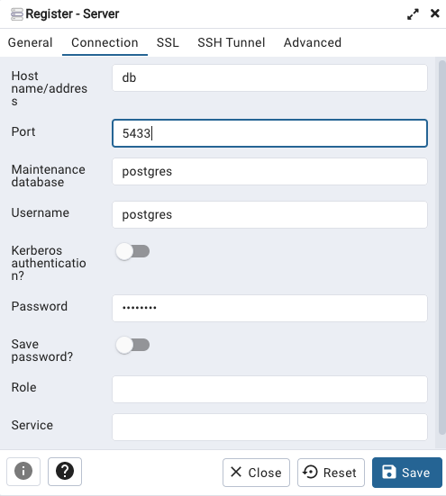
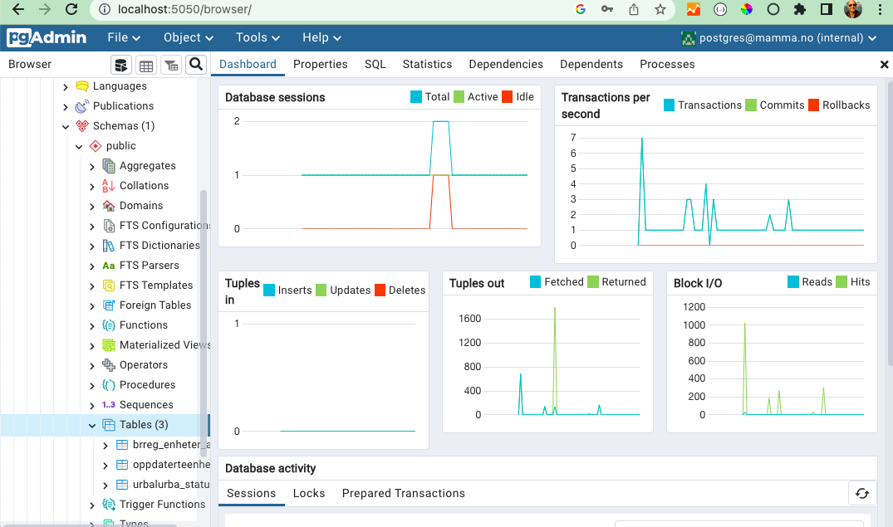

# The shadow database of all companies in Norway
shadow-brreg is a system that creates a shadow database copy of all companies in Norway ( 1 million ). Enables you to play with machine learning, data science, data analysis, data visualization on your local machine with relevant data.

Will run on any machine (Mac, Windows, Linux) in a docker container. Automatic installation of the database and automatic update of the database.  Updated every minute with all changes from Norwegian public company registration, Brønnøysundregistrene (www.brreg.no)

Just copy one file "docker-compose.yml" to your local machine and start it with the command `docker compose up -d`

* If you are using a Mac or Windows you need to install docker desktop. https://www.docker.com/products/docker-desktop If you are using Linux you know what to do.


# Code written by ChatGPT, Github Copilot and me
The code for automatic update of the database is written by by ChatGPT,  @terchris and Github Copilot. In plain english I asked ChatGPT to write the code and he/she/it did. ChatGPT is unstable so I wrote all my questions in a file before pasting the question to ChatGPT. As I was writing my questions, Github Copilot suggested how to write the questions in plain english.  So there I got one AI helping me to talk to another AI.

What impressed me the most was that ChatGPT was able to understand that the database table (brreg_enheter_alle) contains organizations. So I could ask it to do stuff like this:

>The table brreg_enheter_alle is a table of organizations. The number of employees are defined by the field antall_ansatte. Create a new function named getLargestOrganizations that returns the records that has the most employees. Sort the results so that the organization with the largest amount of employees is at the top. There are many records in the table so it must be possible to pass a parameter named numberOfOrganizations to the function getLargestOrganizations that defines how many organizations to return. Use the already defined function displayRecords to display the result.

And ChatGPT wrote the code for me. I just had to copy and paste it into the file and run it. Before I asked ChatGPT to write code for me I asked 20 questions about how to set up the development environment for accessing the database, typescript compiler options, getting debugging to work properly in vscode and so on.

I learned a lot from the experiment. New ways of writing code that I was not aware of.
It was like having a teacher sitting next to me.
Coding style vary a lot in the code that ChatGPT give you. I can undestand this as ChatGPT is trained on code from many developers.
So when I had to write the code for the automatic update of the database (in this repository) I had to change the coding style so that it would be easier to read. 
(parameter names names and how to return values from functions)

There was one more AI assisting me, Copilot and ChatGPT. I'm dyslectic and I often misspell words. I use a chrome plugin named Grammarly that checks and rates the readability of the questions I ask ChatGPT. ChatGPT gives more better answers when the questions are precise.

When creating shadow-brreg i asked ChatGPT 115 questions.
[You will find all auestions and answers here](https://github.com/terchris/shadow-brreg-node/blob/main/chatGPT.MD) Note that the first 20 questions are about setting up the development environment. The rest are about the code for the automatic update of the database.

You will find the code written by ChatGPT, Github Copilot and me in the repository: https://github.com/terchris/shadow-brreg-node The code is in the file [index.ts](https://github.com/terchris/shadow-brreg-node/blob/main/src/index.ts)

# Purpose of shadow-brreg is to make it easy to get access to the data from brreg.no
It will spin up a container that holds a postgres database with all data from brreg.no

The database holds more than a million records. And you can use it to play with machine learning, data science, data analysis, data visualization and so on.

The database is available on port 5433 on the host. This so that the port does not interfere with other postgresql instances you may have.  

pgAdmin is available on port 5051 on the host. To access pgAdmin you need to login with the user `postgres@mamma.no` and the password `postgres`. The URL is `http://localhost:5051`


# Just one file to set it up
To start he whole thing you need just one file. The docker-compose.yml file. This file will download the latest version of the database and start the automatic updating of the database.
You can copy & paste the file or download it with wget or curl.
* copy the docker-compose.yml file to your local dir
```
wget https://raw.githubusercontent.com/terchris/shadow-brreg/main/docker-compose.yml -O docker-compose.yml
```
or 
```
curl https://raw.githubusercontent.com/terchris/shadow-brreg/main/docker-compose.yml -o docker-compose.yml
```

* start the container
In the directory where you downloaded the docker-compose.yml file type:
```
docker compose up -d
```


# Techincal notes

## First time setup

It takes a long time to download and set up the database the first time you start the container. If you want to see what is going on the dirst time you can open a terminal and type:
```
docker compose up
```
When you omit the -d parameter the container will run in the foreground and you can see what is going on. Pressing control C will stop the container.

The first time you start the container it will download a excel file (enheter_alle.xlsx) from Brønnøysundregistrene (brreg.no). The file is 195 MB in size. The download will take some time depending on your internet connection. brreg.no uses the proprietary Microsoft format xlsx. In order to import the file into the database it must be converted to the open format csv. This also takes some time.
Why brreg.no has chosen to use the proprietary Microsoft format xlsx is a mystery to me. And why they do not compress the file is also a mystery.
If brreg.no had used the open format csv and compressed the file it would have been much faster to download and import the file into the database. We would all have saved time, bandwith, disk space and electricity.


[This is the log from a initial startup of shadow-brreg system](initial-startup-log.md)
## Start the container
In the directory where you downloaded the docker-compose.yml file type:
```
docker compose up -d
```

## Stop the container
In the directory where you downloaded the docker-compose.yml file type:
```
docker compose down
```

## Check how many records are imported to the table 
```
docker exec -it shadow-app cat /usr/src/app/database_initiated.txt
```
The result should be something like this:
```
Tue Jan 17 10:58:44 UTC 2023
  count  
---------
 1048575
(1 row)
```


## Updating the database

Changes brreg.no does to their data is fetched and updated in the local databse every minute. All changes they do to the data is available in the database. So you dont have to do anything to get the latest data. If you stop the container and start it again it will find the changes since last time and update the database.


## passwords and security

The database user is `postgres` and the password is `postgres` and everyone that has access to your host at port 5433 can add and delete stuff in your database.
I suggest that you edit the script and change the password. Or safest you just stop the container when you are not using it.


## How to access the database from your code

The database is available on port 5433 on the host. This so that the port does not interfere with other postgresql instances you may have.

An example on how to access the database from your code:
```TypeScript
async function getOrganizations(query: string, limit: number): Promise<any[]> {

    let rows: any[] = [];
    try {
        const res = await pool.query(`${query} LIMIT $1`, [limit]);
        rows = res.rows;
    } catch (err) {
        console.log(err);
    }
    return rows;
}
```


```
databasename: importdata
user: postgres
password: postgres
table: brreg_enheter_alle
port: 5433
```
## About disk space

The database (docker volume) takes about 733 MB on disk. The database is updated every minute and we keep track of all changes. So it will grow over time. If you dont need to keep track of changes you can just delete all (images, containers, volumes) and start over again. The database will be downloaded again and you will have a fresh database with all organizations.

## A note on pdAdmin
pgAdmin is a tool for managing postgres databases. It is not needed to access the database. But it is nice to have. It is available on port 5051 on the host. http://localhost:5051 if all is running on your local machine.

* use ´db´ as the server name to access the database



* The database tables are:
You can see them and their definition in pgAdmin.
 