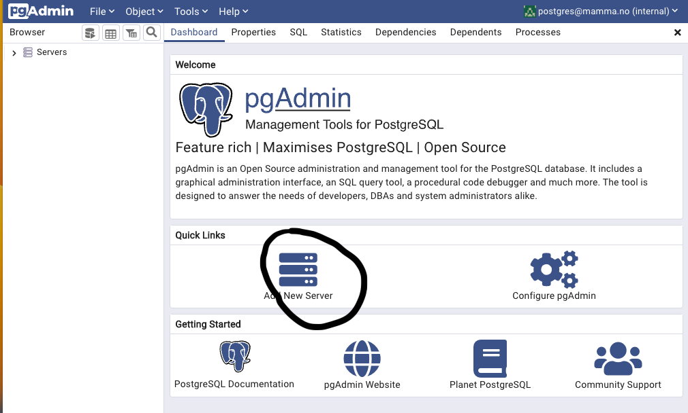
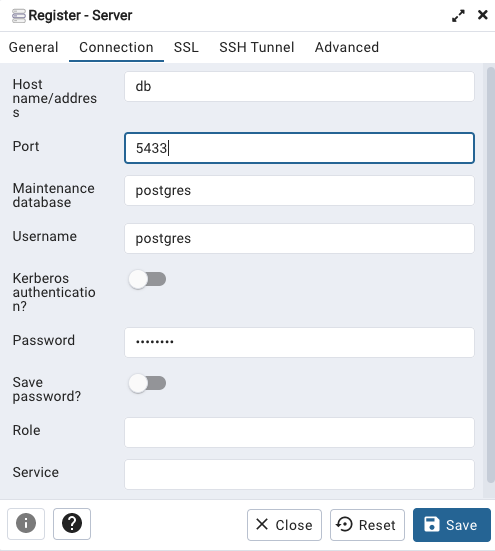
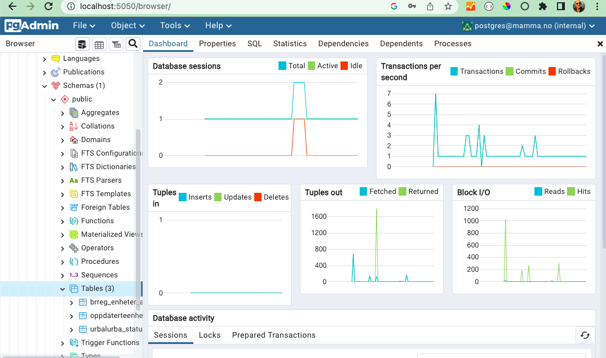
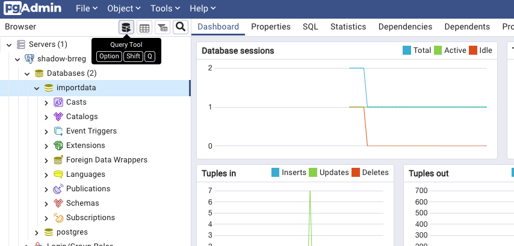
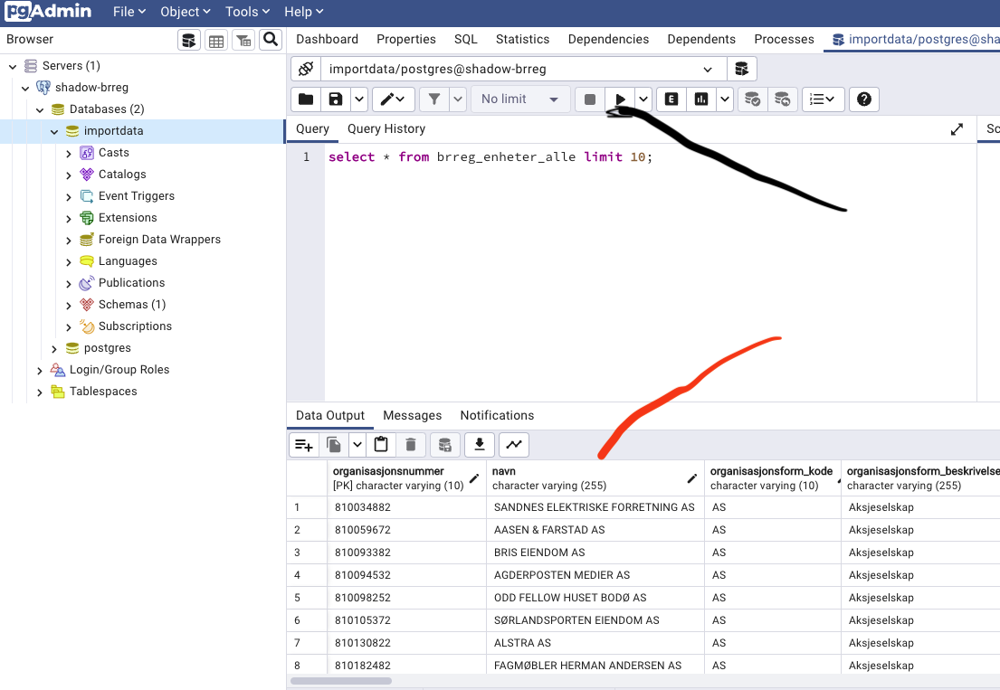
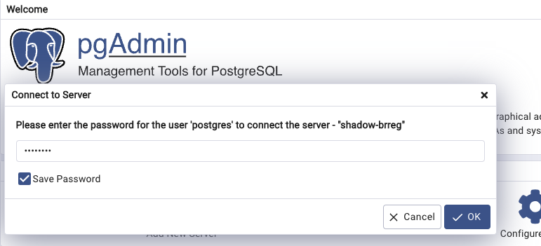

# How set up pgAdmin to acces the data

The shadow copy of all data from brreg.no is available in a postgresql database. The simplest way to access the data is to use pgAdmin. pgAdmin is a graphical user interface for postgresql. You can read more about pgAdmin [here](https://www.pgadmin.org/).

## Starting pgAdmin

pgAdmin is already set up and available on port 5051 on the host. http://localhost:5051 if all is running on your local machine. So nothing to do here.

## Logging in to pgAdmin

Open pgAdmin in your browser by clicking on this link http://localhost:5051 . You will be presented with a login screen. Use the following credentials: email: `postgres@mamma.no` ans password: `postgres`.


## Set up a connection to the database

Click on the `Add New Server` button.


Enter the following information:

* Name: `shadow-brreg`
* Host name/address: `db`
* Port: `5433`
* Maintenance database: `postgres`
* Password: `postgres`



Click on the `Save` button.

Note: host name is `db`. This is because the container running postgres is known to pgadmin as the host running the postgres server. 

## Access the database and see the tables

To see the tables you need to expand the tree in pgAdmin. Open it so that it looks like this:



## Do a test query to the database

1. Open Query tool
To do a test query you can click on the `SQL` button in the toolbar. This will open a new window where you can type in a query.



2. Write a simple query
In the query window type in the following query:

```sql
select * from brreg_enheter_alle limit 10;
```

Click the `Play` button to run the query. And you should get a result like this:



Now we know that there is data in the database and that we can access it. To see the number of organisations in the database we can run the following query:

```sql
select count(*) from brreg_enheter_alle;
```

I got `1048794` as a result. This is the number of organisations in the database.

We can ask the database to show us the information about one spesiffic organisation. For example the organisation with the organisation number 819439842. To do this we can run the following query:

```sql
select * from brreg_enheter_alle where organisasjonsnummer = '819439842';
```

This will list all fields for the organisation "SMARTE BYER NORGE AS".

If this works you are ready to start working with the data.


# Problem and fixes

* Prompted for a password. Type `postgres` as password, select save password and click on the `OK` button.
